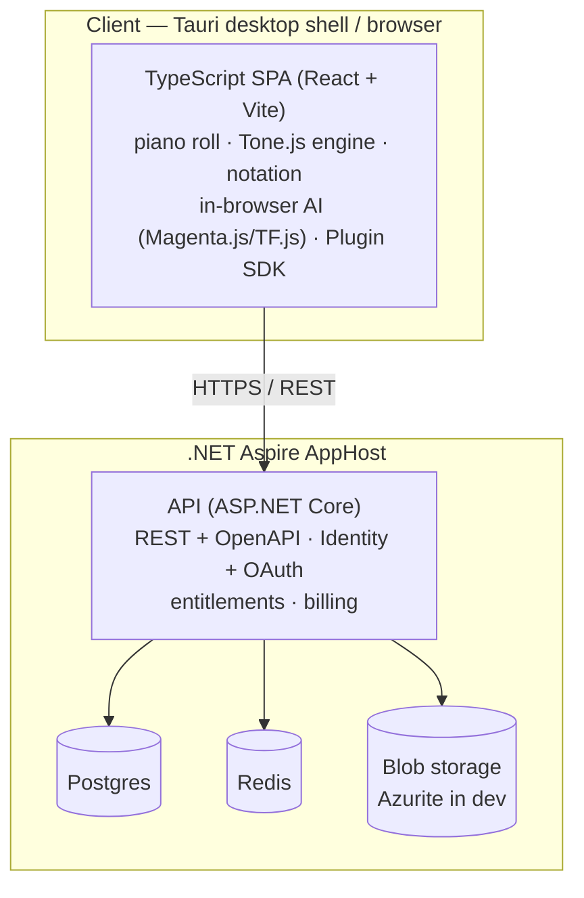

# Cadence

> **AI-powered, cross-platform music creation studio.** Stupid-easy for newcomers,
> endlessly extensible for pros. Built test-first, delivered by a Squad team of teams.

> ℹ️ **Name.** The Brand & Design squad chose **Cadence** and shipped a full brand kit
> (logo, palette, type, sonic identity). Final trademark clearance is a founder/legal
> call before public launch — see [`docs/brand/naming.md`](docs/brand/naming.md).

## What it is

Cadence is a **Tauri** desktop app (cross-platform from day one) wrapping a TypeScript
SPA, backed by a **.NET Aspire** service graph. Today you can:

- Compose in a **piano-roll** editor with a Tone.js audio engine, instruments, transport,
  and MIDI import/export.
- Get **AI composition suggestions** — continue a melody, harmonize, suggest chords —
  running entirely in the browser (Magenta.js + TensorFlow.js).
- **Sign in** with a local account, a passwordless magic link, or GitHub/Google/Microsoft
  OAuth, and persist projects to your own library.
- Go **freemium**: entitlements gate free vs. Pro, free WAV exports carry an audible
  watermark, and Stripe drives the subscription lifecycle.
- **Import/export/share** — MIDI, MusicXML, and WAV, plus portable `.cadence.json` files
  and client-side share links.
- **Extend the composer** through a typed, in-process **Plugin SDK** — instruments,
  effects, formats, AI providers, commands, and panels.
- **Self-deploy** the backend to Azure Container Apps with `azd`, with a landing +
  docs site published to GitHub Pages.

**In progress:** live collaboration (Yjs CRDT + presence, [#9](https://github.com/IEvangelist/cadence/issues/9))
and audio **stem separation** (Demucs/ONNX, [#10](https://github.com/IEvangelist/cadence/issues/10)).

## Feature matrix

| Capability | Status | Docs |
|---|---|---|
| Brand kit & design tokens | ✅ Shipped | [`docs/brand/`](docs/brand/README.md) |
| Composer (piano roll, transport, instruments, MIDI) | ✅ Shipped | [`docs/architecture.md`](docs/architecture.md) |
| In-browser AI assistant (continue / harmonize / suggest) | ✅ Shipped | [`docs/architecture.md`](docs/architecture.md) |
| Identity, profiles, OAuth + magic-link | ✅ Shipped | [`docs/auth-setup.md`](docs/auth-setup.md) |
| Freemium billing, entitlements & audio watermark | ✅ Shipped | [`docs/billing-setup.md`](docs/billing-setup.md) |
| Import / export (MIDI · MusicXML · WAV) + client share | ✅ Shipped | [`docs/share.md`](docs/share.md) |
| Plugin SDK / extensibility | ✅ Shipped | [`docs/plugins.md`](docs/plugins.md) |
| Self-deploy (`azd` → Azure Container Apps) + landing/docs site | ✅ Shipped | [`infra/README.md`](infra/README.md) |
| Interactive API reference (OpenAPI + Scalar) | ✅ Shipped | [`docs/architecture.md`](docs/architecture.md) |
| Live collaboration (Yjs CRDT + presence) | 🚧 In progress | [`docs/plan.md`](docs/plan.md) |
| Stem separation (Demucs/ONNX) | 🚧 In progress | [`docs/plan.md`](docs/plan.md) |
| Premium server-side AI · hosted share links | ⬜ Planned | [`docs/plan.md`](docs/plan.md) |

## Run locally

**Prerequisites**

- **.NET 10 SDK** (pinned in [`global.json`](global.json)).
- **Docker Desktop**, running — Aspire starts Postgres, Redis, and the Azurite blob
  emulator as containers.
- **Node.js LTS** (≥ 20) for the web SPA and Tauri shell.

**Start the backend** — the Aspire AppHost boots the API plus Postgres, Redis, and blob
storage, and opens the **Aspire dashboard** (resource list, logs, traces, metrics):

```bash
dotnet run --project src/Cadence.AppHost
```

**Start the web UI** — in a second terminal, run the Vite dev server from the repo root
(npm workspaces):

```bash
npm ci                                   # once: install exact, lockfile-pinned deps
npm run dev --workspace @cadence/web     # http://localhost:5173
```

The dashboard lists the running `api`, `postgres`, `redis`, and `blobs` resources and the
API's endpoint; open the web URL above to use the composer. To run the **desktop shell**
instead of the browser, use `npm run dev --workspace @cadence/desktop` (Tauri) — it needs
the [Rust toolchain and Tauri prerequisites](https://v2.tauri.app/start/prerequisites/).

No secrets are required for a local run: OAuth providers and Stripe billing stay off until
you supply credentials via user-secrets. See [`docs/auth-setup.md`](docs/auth-setup.md) and
[`docs/billing-setup.md`](docs/billing-setup.md).

## Architecture

A TypeScript SPA (shipped in the browser and inside a Tauri desktop shell) talks over
HTTPS to a .NET Aspire service graph. The API owns identity, entitlements, and project
persistence over Postgres, Redis, and Blob storage, and ships an interactive OpenAPI
reference (Scalar) at `/scalar`. See [`docs/architecture.md`](docs/architecture.md) for
the detailed view.



| Layer | Choice |
|---|---|
| Desktop shell | Tauri (Rust) |
| Web UI | TypeScript SPA (React + Vite) |
| Audio/MIDI | Tone.js / Web Audio, Web MIDI, soundfonts |
| Notation | OpenSheetMusicDisplay + VexFlow |
| AI (core) | Symbolic assistant — in-browser Magenta.js / TF.js |
| Backend | .NET Aspire, ASP.NET Core (REST + OpenAPI) |
| Data | Postgres + Azure Blob Storage + Redis |
| Auth | ASP.NET Core Identity + OAuth (GitHub/Google/Microsoft) + email magic-link |
| Billing | Stripe (freemium; free tier = watermarked audio + limits) |
| Deploy | Azure Container Apps via `azd` + GitHub Actions; landing/docs on GitHub Pages |

## Repository layout

```
apps/web       TypeScript SPA (Vite + React)
apps/desktop   Tauri desktop shell (Rust) — requires the Rust toolchain
src            .NET services (Aspire AppHost, ServiceDefaults, API, EF Core data)
tests          Test projects (unit + integration)
infra          azd / IaC and deployment assets
docs           Architecture, setup guides, brand kit, plan/roadmap
site           Landing + docs site (tracked separately)
.squad         Squad team-of-teams state
```

## Contributing & testing

Cadence is built **test-first** — every behavior change lands with a test that fails
before the change and passes after it. The full harness (Vitest, Playwright + axe-core,
xUnit, Aspire integration tests, coverage gates, and the security/supply-chain scanners)
is documented in [`docs/testing.md`](docs/testing.md).

```bash
npm test                 # web unit tests (Vitest)
npm run e2e              # web e2e + accessibility (Playwright)
dotnet test              # .NET unit tests (xUnit)
```

All dependencies are pinned deterministically; see
[`docs/versioning-policy.md`](docs/versioning-policy.md). Browse every guide from the
[documentation index](docs/README.md). Work is expressed as GitHub Issues and routed by
the Squad team of teams — see [`docs/squad-ops.md`](docs/squad-ops.md) for the routing
rules and mandatory human approval gates.

## Delivery model — Squad

Development is driven by [**Squad**](https://github.com/bradygaster/squad), a human-led
AI agent-team tool for GitHub Copilot. We run a *team of teams*: an orchestrator/lead
squad plus one specialist squad per effort (Brand, Frontend, Backend, AI/ML, Realtime,
DevOps, QA/Test, Docs, and more).

```bash
npm install -g @bradygaster/squad-cli
squad init --preset default
gh auth login
copilot --agent squad --yolo
```

Humans stay accountable for priorities, approvals, and final merges. Autonomous
execution and auto-merge are **off by default** — see
[`docs/squad-ops.md`](docs/squad-ops.md).

## Status

🚀 **Actively building.** The composer, in-browser AI, identity, billing, formats,
plugin SDK, and self-deploy are shipped; live collaboration and stem separation are in
progress. See [`docs/plan.md`](docs/plan.md) for the full roadmap and delivery status.
