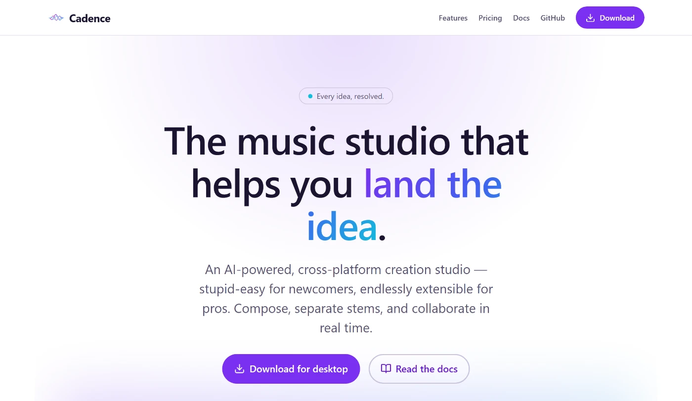
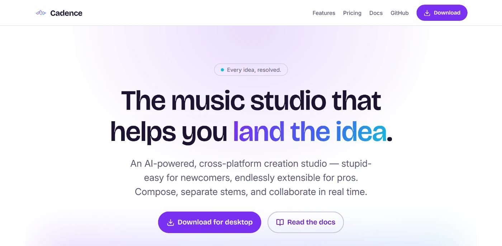
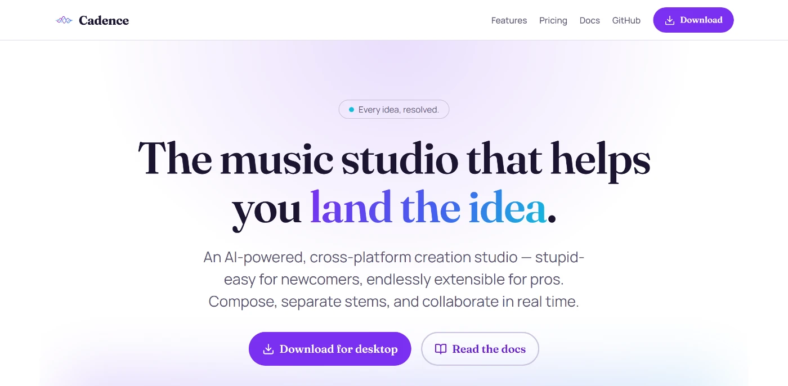
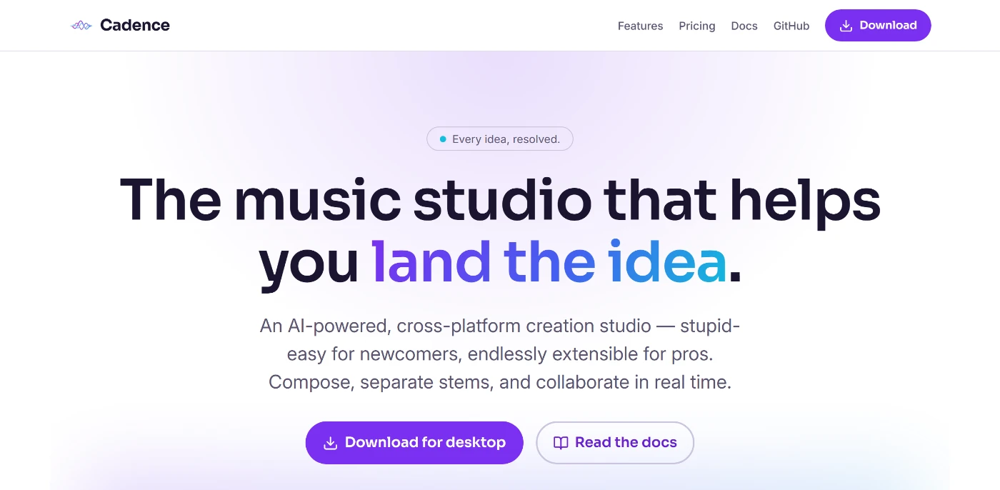
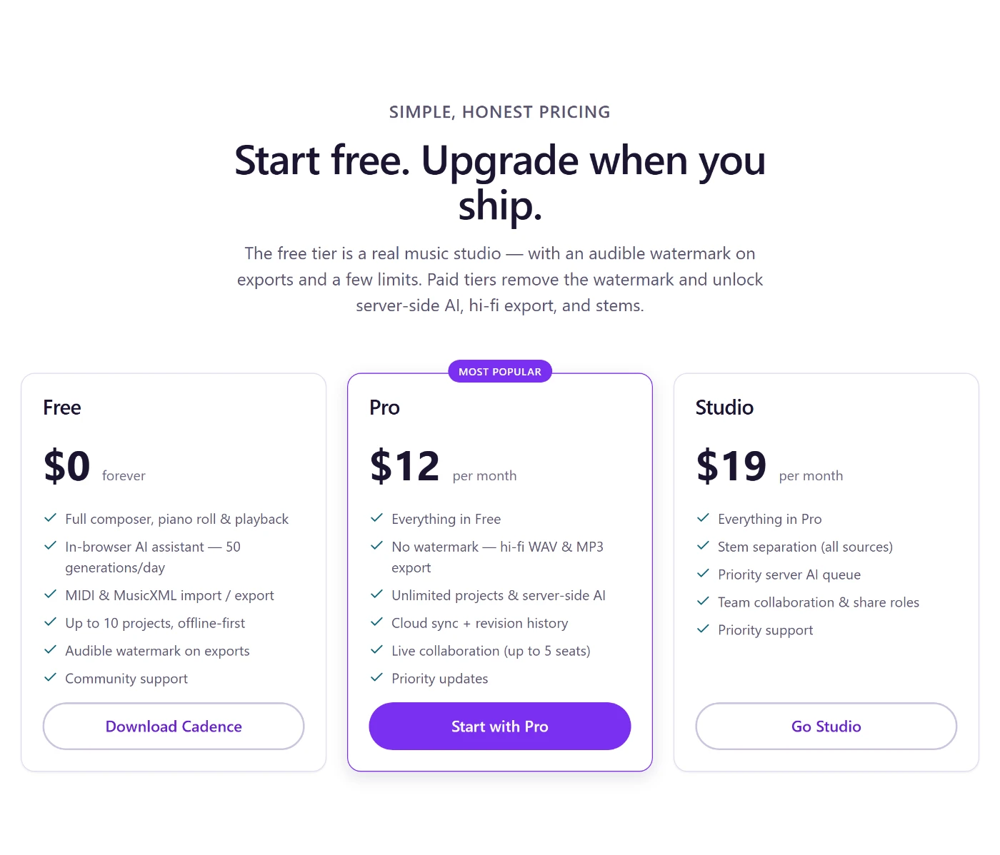
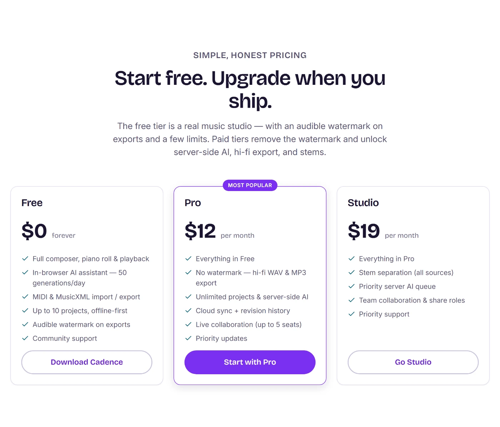
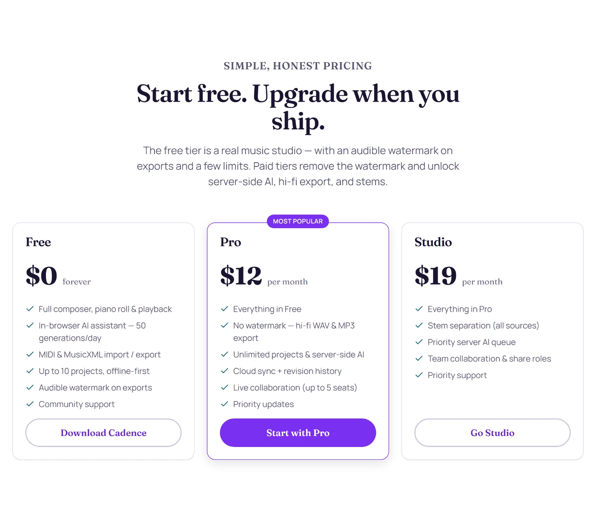
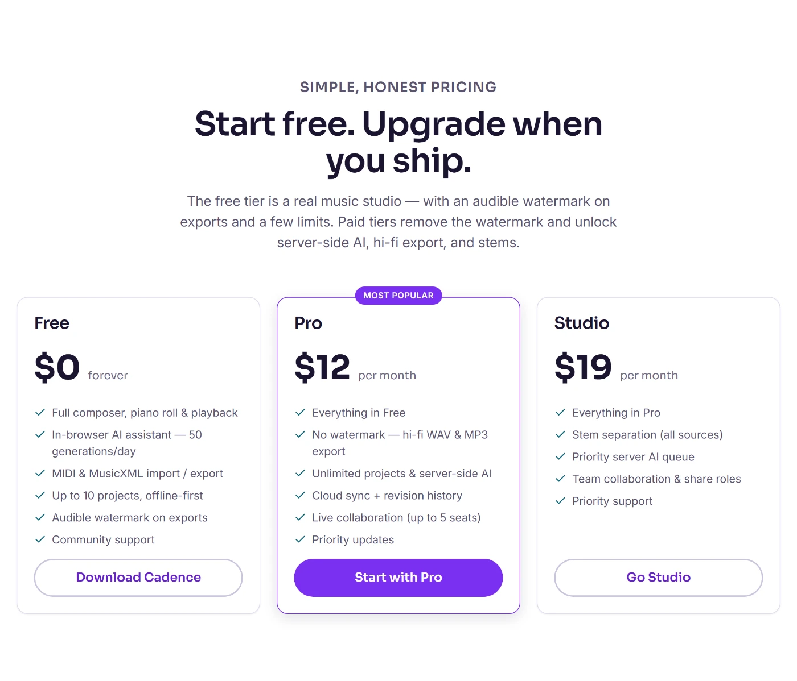
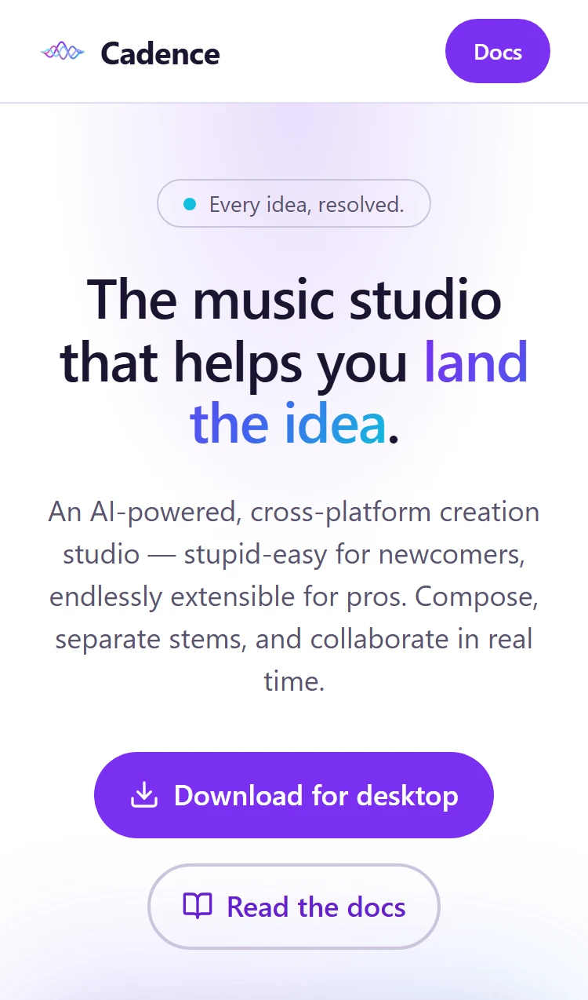
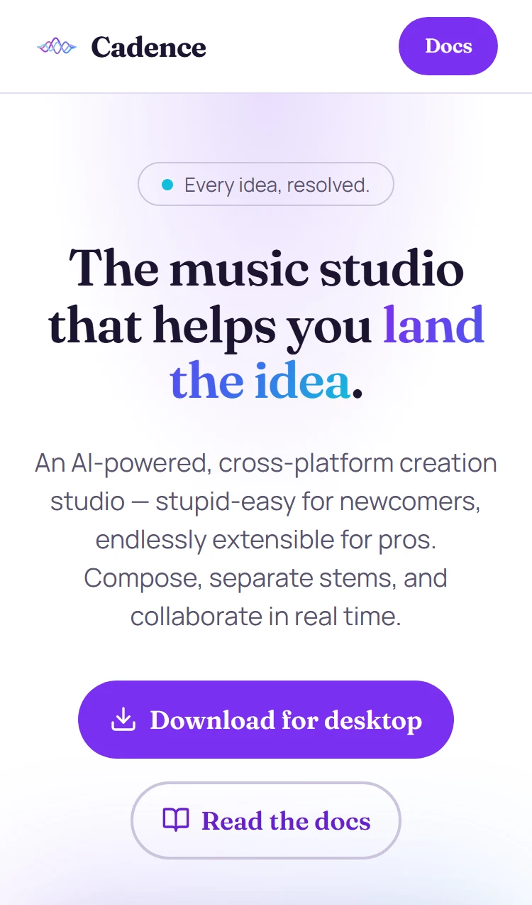

# Landing-page typeface exploration — issue #78

David flagged that the current landing-page type "isn't landing." The root cause
turned out to be concrete: the site **named** `Space Grotesk` / `Inter` in the
design tokens but **never loaded them** — there was no `@font-face`, no `<link>`,
no preload, and no font files anywhere under `site/`. So every visitor fell back
to the local system sans (`Segoe UI` on Windows, Arial/Roboto elsewhere), which
reads like a generic template — exactly the "isn't landing" symptom.

This PR self-hosts real, performant OFL fonts and explores **three** distinctive
pairings. Each pairs a display face (hero headline + `Cadence` wordmark) with a
clean body face (docs/pricing copy). The screenshots below are generated by
[`scripts/capture-type-eval.mjs`](../../scripts/capture-type-eval.mjs).

## The pick

**Default shipped in this PR: Candidate A — Bricolage Grotesque + Inter.** It is
the "distinctive-but-legible" sweet spot: a characterful editorial grotesque that
gives the headline and wordmark real personality and a premium, musical feel,
while Inter keeps docs/pricing copy maximally readable. To switch to an
alternative, change `ACTIVE_TYPEFACE` in
[`src/lib/typeface.ts`](../../src/lib/typeface.ts) — it drives both the
`<html data-typeface>` token selection and the preload hints in one place.

| Candidate | Display | Body | One-line rationale |
| --- | --- | --- | --- |
| **A — default** | **Bricolage Grotesque** | **Inter** | Distinctive editorial grotesque; premium and characterful yet fully legible — the safest strong choice. |
| B | Fraunces | Manrope | Expressive "soft-serif" display; the most musical/luxe, editorial voice — a bigger swing. |
| C | Sora | Inter | Clean geometric display; modern, techy, confident — the most restrained option. |

## Before → after (hero + wordmark)

The "before" is the shipped baseline (system sans, since no brand font ever loaded).

| Before (system sans) | A · Bricolage Grotesque |
| --- | --- |
|  |  |

| B · Fraunces | C · Sora |
| --- | --- |
|  |  |

## Pricing section

| Before (system sans) | A · Bricolage Grotesque |
| --- | --- |
|  |  |

| B · Fraunces | C · Sora |
| --- | --- |
|  |  |

## Mobile (375px) — no overflow regression

| Before | A · Bricolage | B · Fraunces | C · Sora |
| --- | --- | --- | --- |
|  |  |  |  |

## Performance & accessibility

- **Self-hosted, no third parties.** Five latin-subset **variable** woff2 files
  (24–75 KB each) live in [`/public/fonts`](../../public/fonts); no Google Fonts
  request, no npm dependency added (keeps the `site` CI `npm audit` gate clean).
- **Only the active pair is preloaded.** BaseLayout emits `<link rel="preload">`
  for just the default display + body woff2; the other three faces are declared
  but never fetched by the browser (unreferenced `@font-face` don't download).
- **No FOUT/CLS.** `font-display: swap` plus a metric-matched `local('Arial')`
  fallback for every family (computed `size-adjust` / `ascent-override` /
  `descent-override` from the real font metrics, capsize/next-font method) so the
  fallback reserves the same space and the swap doesn't shift layout.
- **Accessibility unchanged.** Colors/contrast are untouched (all AA), and the
  existing Playwright suite stays green: axe WCAG 2.0/2.1 A/AA, the 375px
  no-horizontal-overflow check, and the internal link/asset crawl.

## Reproduce the screenshots

```bash
cd site
npm ci
npm run build
npm run preview -- --port 4321      # leave running
node scripts/capture-type-eval.mjs  # writes docs/type-eval/*.webp
```

All five families are SIL Open Font License 1.1 — see
[`/public/fonts/LICENSES.md`](../../public/fonts/LICENSES.md).
